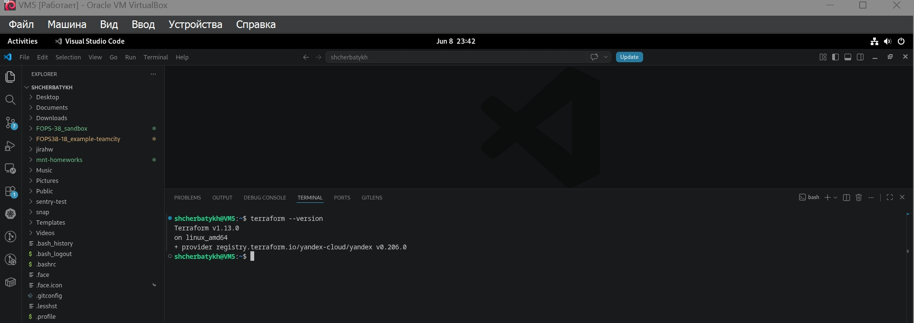
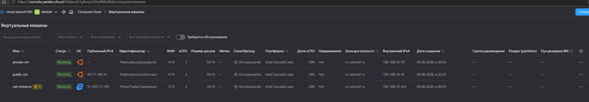
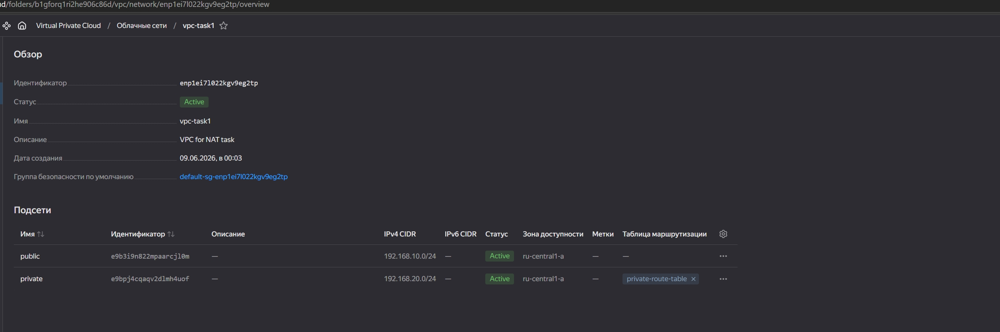
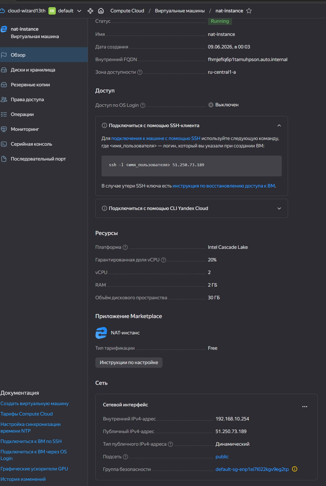
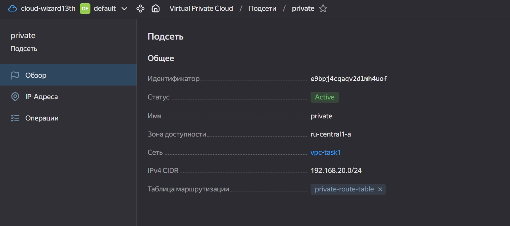
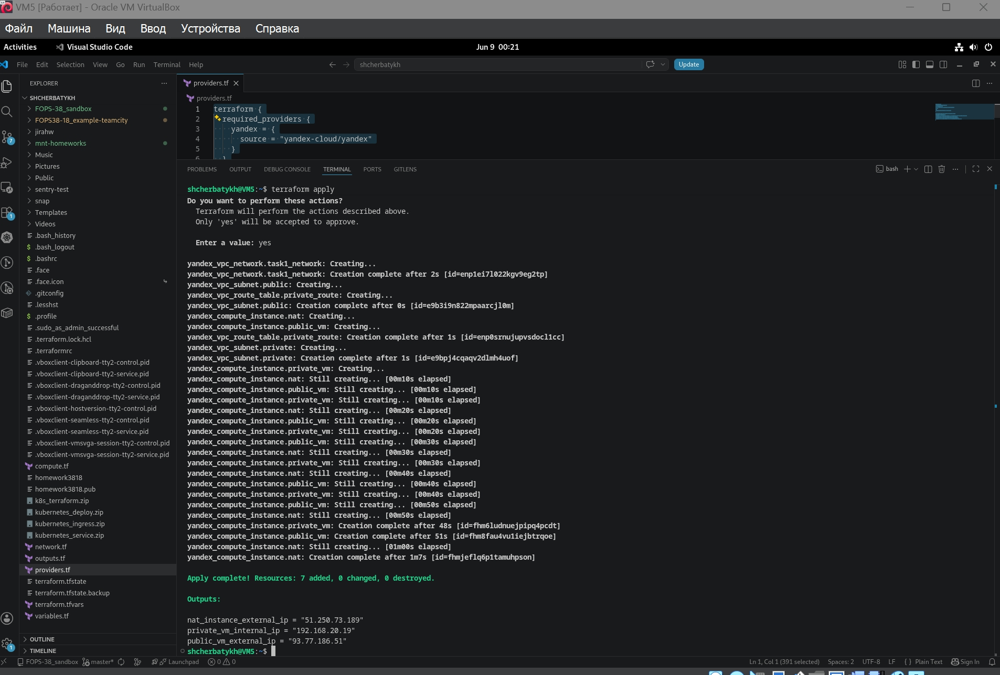
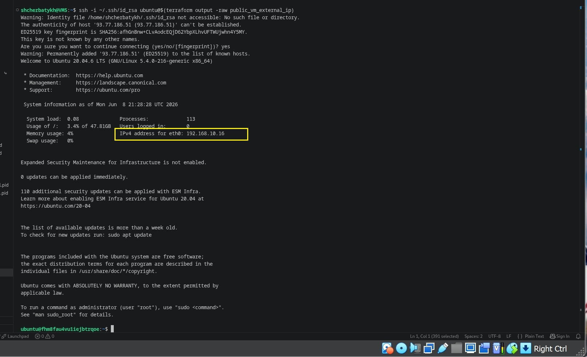
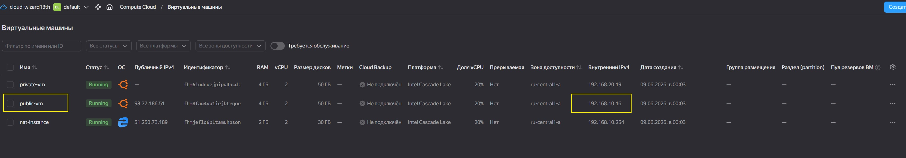
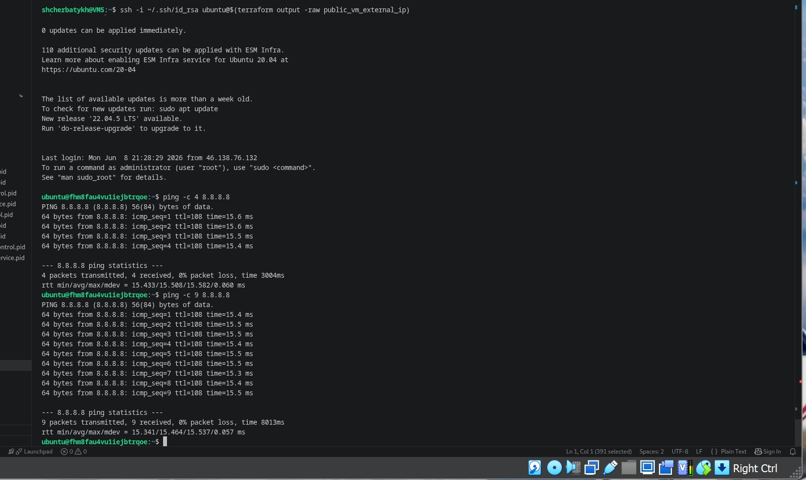

## Домашнее задание к занятию «Организация сети» FOPS-38 (Щербатых А.Е.)

### Задание 1. Yandex Cloud

**Что нужно сделать**

1. Создать пустую VPC. Выбрать зону.
2. Публичная подсеть.
- Создать в VPC subnet с названием public, сетью 192.168.10.0/24.
- Создать в этой подсети NAT-инстанс, присвоив ему адрес 192.168.10.254. В качестве image_id использовать fd80mrhj8fl2oe87o4e1.
- Создать в этой публичной подсети виртуалку с публичным IP, подключиться к ней и убедиться, что есть доступ к интернету.
3. Приватная подсеть.
- Создать в VPC subnet с названием private, сетью 192.168.20.0/24.
- Создать route table. Добавить статический маршрут, направляющий весь исходящий трафик private сети в NAT-инстанс.
- Создать в этой приватной подсети виртуалку с внутренним IP, подключиться к ней через виртуалку, созданную ранее, и убедиться, что есть доступ к интернету.

---

### Ответ 1.

У меня уже установлен Terrafom на локальной ВМ под управлением Debian 12 



Создаю playbook Terraform c блоком провайдера ```providers.tf```

```bash
terraform {
  required_providers {
    yandex = {
      source = "yandex-cloud/yandex"
    }
  }
  required_version = ">= 0.13"
}

# Конфигурация провайдера Yandex Cloud
provider "yandex" {
  token     = var.yc_token     # OAuth-токен (из переменных)
  cloud_id  = var.yc_cloud_id  # ID облака
  folder_id = var.yc_folder_id # ID каталога
  zone      = var.zone         # Зона для ресурсов
}
```
Затем [compute.tf](https://github.com/Anton-Shcherbatykh/FOPS-38_22/blob/main/22-01/Files/compute.tf) в котором описываю три ВМ: 
- NAT-инстанс;
- ВМ public-vm с публичным IP, имеющую доступ в интернет напрямую;
- ВМ private-vm без публичного IP, доступную только через public-vm.



Потом [network.tf](https://github.com/Anton-Shcherbatykh/FOPS-38_22/blob/main/22-01/Files/network.tf) в котором 

Создаю VPC в зоне ru-central1-a.



Публичную подсеть public (192.168.10.0/24) которая содержит:

- NAT-инстанс с внутренним адресом 192.168.10.254 и внешним IP (через nat = true).



Приватную подсеть private (192.168.20.0/24) содержит:

- Таблицу маршрутизации, направляющую весь трафик (0.0.0.0/0) на NAT-инстанс.



Не забываем создать [variables.tf](https://github.com/Anton-Shcherbatykh/FOPS-38_22/blob/main/22-01/Files/variables.tf) в котором опишем все переменные.

А также для удобства создаю [outputs.tf](https://github.com/Anton-Shcherbatykh/FOPS-38_22/blob/main/22-01/Files/outputs.tf) чтобы после команды ```terraform apply``` увидеть IP-адреса созданных ВМ



Файл [terraform.tfvars](https://github.com/Anton-Shcherbatykh/FOPS-38_22/blob/main/22-01/Files/terraform.tfvars) прикладываю к выполнению ДЗ в "очищенном" виде в целях безопасности (ну т.е. "как положено").


После того, как всё создано, подключаюсь к публичной ВМ командой

```bash
ssh -i ~/.ssh/id_rsa ubuntu@$(terraform output -raw public_vm_external_ip)
```





Успешно подключивших, проверяю доступ в интернет


