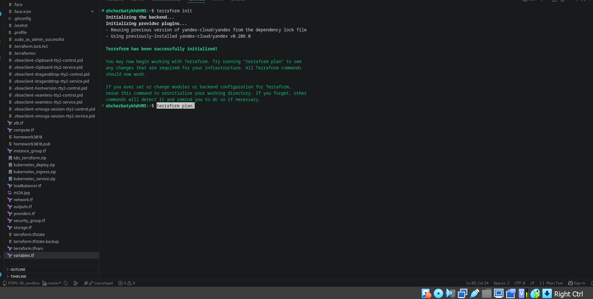
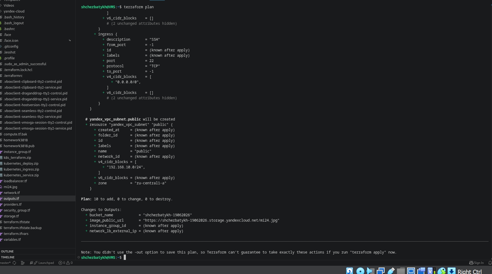
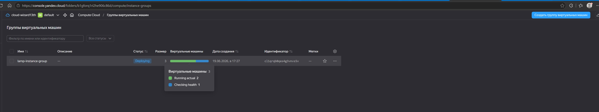
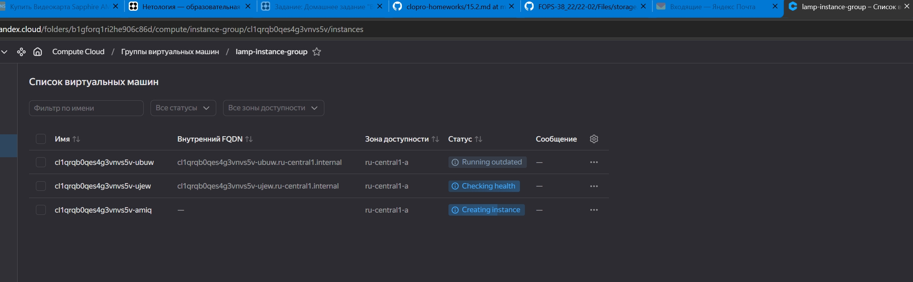
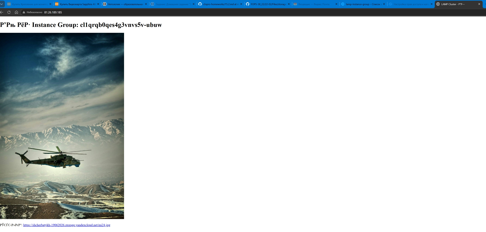
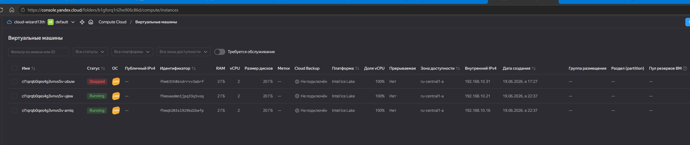
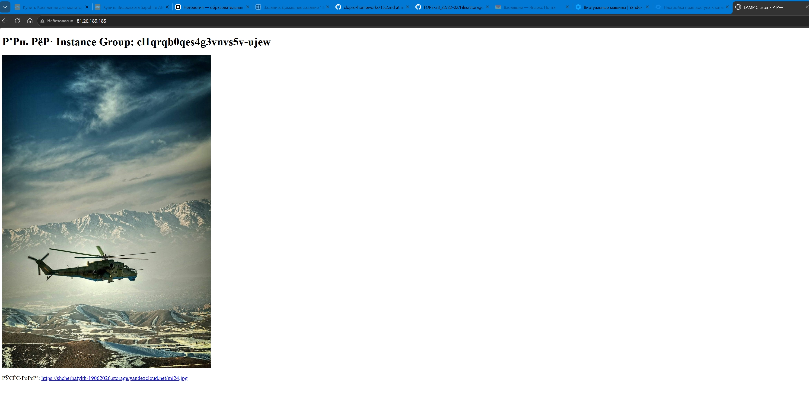
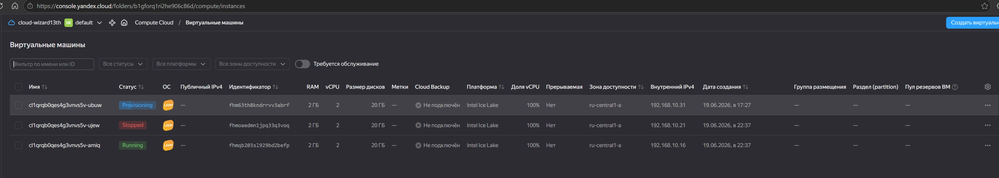
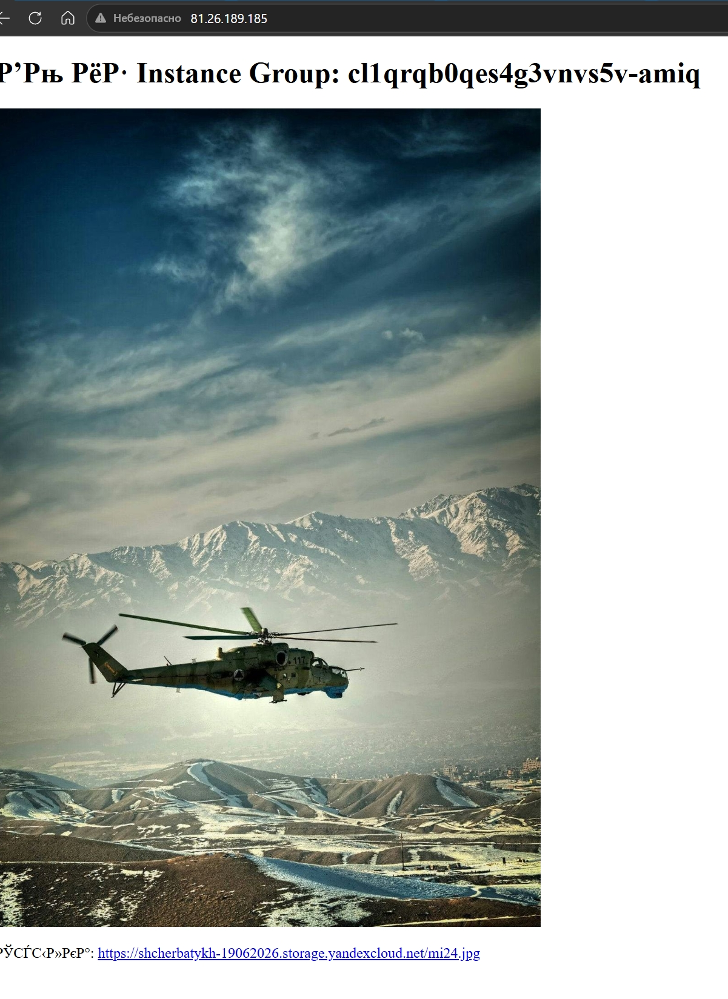

## Домашнее задание к занятию «Вычислительные мощности. Балансировщики нагрузки» FOPS-38 Щербатых А.Е.

### Задание 1. Yandex Cloud
Что нужно сделать

1. Создать бакет Object Storage и разместить в нём файл с картинкой:

- Создать Instance Group с тремя ВМ и шаблоном LAMP. Для LAMP рекомендуется использовать image_id = fd827b91d99psvq5fjit.
- Для создания стартовой веб-страницы рекомендуется использовать раздел user_data в meta_data.
- Разместить в стартовой веб-странице шаблонной ВМ ссылку на картинку из бакета.
- Настроить проверку состояния ВМ.

2. Создать группу ВМ в public подсети фиксированного размера с шаблоном LAMP и веб-страницей, содержащей ссылку на картинку из бакета:

- Создать бакет в Object Storage с произвольным именем (например, имя_студента_дата).
- Положить в бакет файл с картинкой.
- Сделать файл доступным из интернета.

3. Подключить группу к сетевому балансировщику:

- Создать сетевой балансировщик.
- Проверить работоспособность, удалив одну или несколько ВМ.

4. (дополнительно)* Создать Application Load Balancer с использованием Instance group и проверкой состояния.

---

### Решение 1.

Создаём [providers.tf](https://github.com/Anton-Shcherbatykh/FOPS-38_22/blob/main/22-02/Files/providers.tf) в котором прописываем настройка провайдера Yandex Cloud, подключение к облаку.

Затем создаём 

[variables.tf](https://github.com/Anton-Shcherbatykh/FOPS-38_22/blob/main/22-02/Files/variables.tf) — где объявляем переменные, используемые в конфигурации.

[terraform.tfvars](https://github.com/Anton-Shcherbatykh/FOPS-38_22/blob/main/22-02/Files/terraform.tfvars) — файл с конкретными значениями переменных (токен, ID облака и т.д.).

[network.tf](https://github.com/Anton-Shcherbatykh/FOPS-38_22/blob/main/22-02/Files/network.tf) — создание VPC, публичной и приватной подсетей, таблицы маршрутизации для NAT.

[security_group.tf](https://github.com/Anton-Shcherbatykh/FOPS-38_22/blob/main/22-02/Files/security_group.tf) — создание группы безопасности для ВМ, разрешающей HTTP и SSH.

[storage.tf](https://github.com/Anton-Shcherbatykh/FOPS-38_22/blob/main/22-02/Files/storage.tf) — создание сервисного аккаунта для Object Storage, статических ключей, бакета и загрузка картинки с публичным доступом.

[instance_group.tf](https://github.com/Anton-Shcherbatykh/FOPS-38_22/blob/main/22-02/Files/instance_group.tf) — создание сервисного аккаунта для группы ВМ, самой Instance Group из 3 ВМ на LAMP-образе, настройка user_data для веб-страницы и health check.

[loadbalancer.tf](https://github.com/Anton-Shcherbatykh/FOPS-38_22/blob/main/22-02/Files/loadbalancer.tf) — создание целевой группы (на основе IP-адресов ВМ) и сетевого балансировщика с привязкой к целевой группе.

[outputs.tf](https://github.com/Anton-Shcherbatykh/FOPS-38_22/blob/main/22-02/Files/outputs.tf) — вывод важной информации: публичный IP NAT-инстанса, внутренний IP балансировщика, URL картинки и ID группы.

Проверяем сам terraform - всё в порядке, инициализация прошла успешно



Выполняем ```terraform plan```



Создаём Instance Group (и все остальные ресурсы, кроме балансировщика)

```bash
terraform apply -target=yandex_compute_instance_group.lamp_ig -parallelism=1
```

Эта команда создаст:

- VPC, подсеть, группу безопасности
- Бакет и картинку
- Сервисные аккаунты и роли
- Instance Group с тремя ВМ



После успешного завершения целевая группа будет создана автоматически.

В процессе создания ВМ заодно можно проверить, как отрабатывает механизм проверки "здоровья" ВМ.



После того как группа ВМ создана, создаём балансировщик, подключая его к целевой группе

```bash
terraform apply -parallelism=1
```

Честно говоря, совсем упустил из вида сделать скрин с выводм IP адреса балансировщика. Но на следующих скринах будет видно, что переключение при отключении одной или нескольких ВМ происходит корректно.

Заходим по IP адресу балансировщика и видим, что изображение отображается корректно.

Видим, что изображение "стягивается" с ВМ ```ubuw```



Останавливаем её 



и проверяем снова в браузере, теперь изображение "стягивается с ВМ ```ujew```



Затем останавливаем и эту ВМ



и видим, что теперь получаем изображение с ВМ ```amiq```


