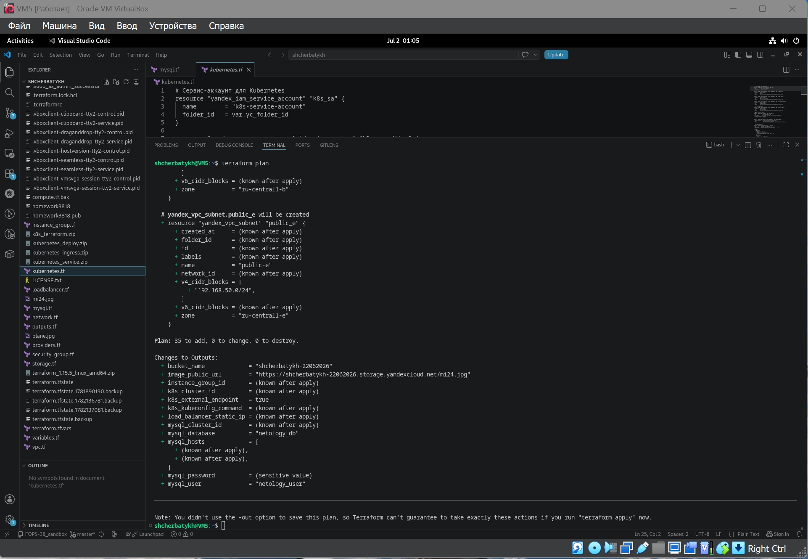
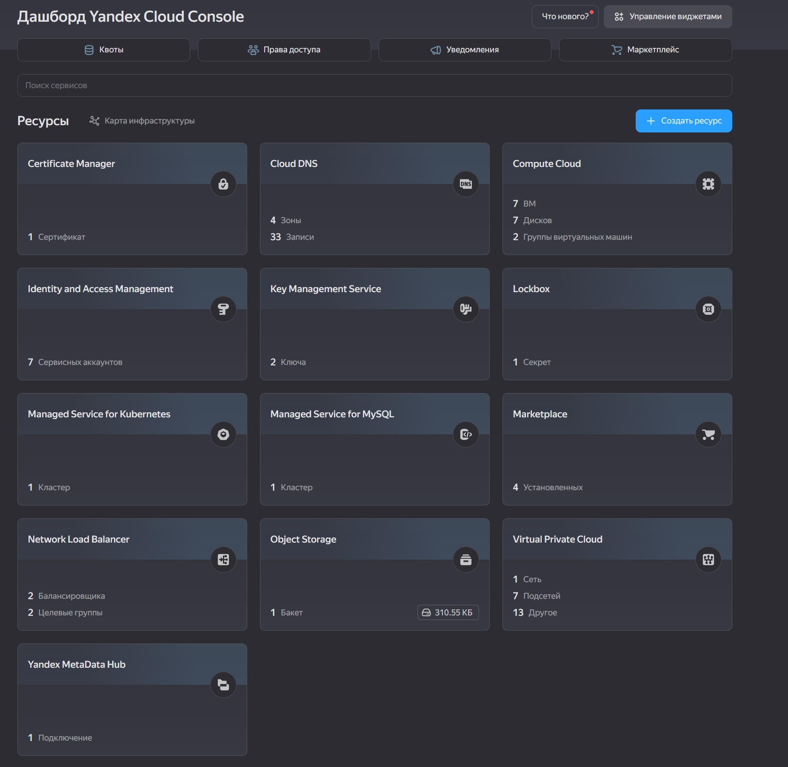
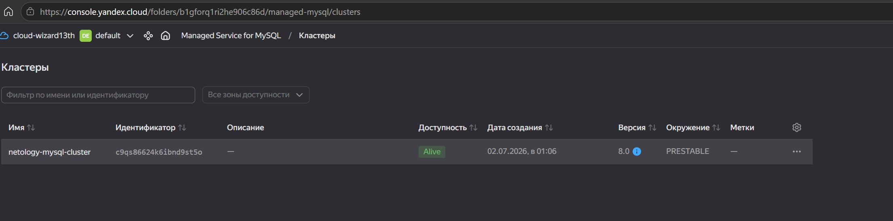
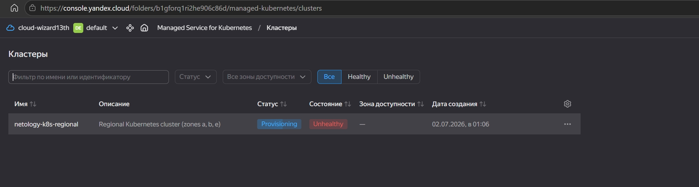
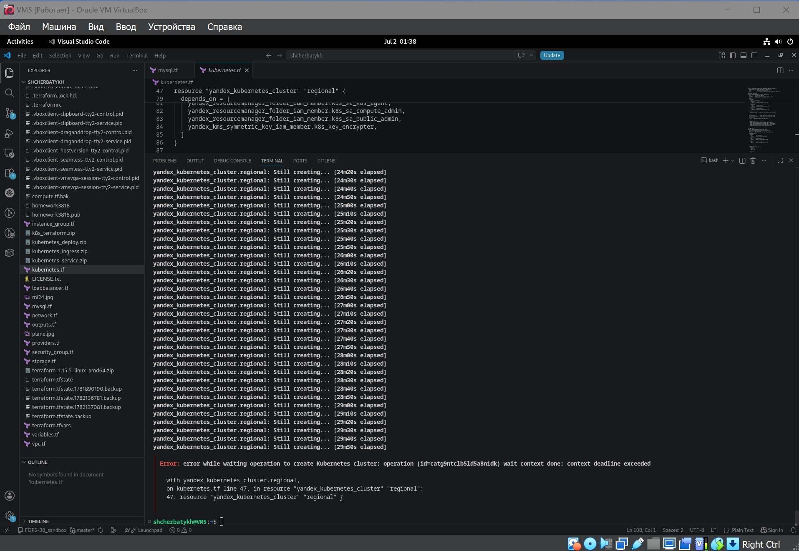

Домашнее задание к занятию «Кластеры. Ресурсы под управлением облачных провайдеров» FOPS-38 (Щербатых А.Е.)

Задание 1. Yandex Cloud
1. Настроить с помощью Terraform кластер баз данных MySQL.
- Используя настройки VPC из предыдущих домашних заданий, добавить дополнительно подсеть private в разных зонах, чтобы обеспечить отказоустойчивость.
- Разместить ноды кластера MySQL в разных подсетях.
- Необходимо предусмотреть репликацию с произвольным временем технического обслуживания.
- Использовать окружение Prestable, платформу Intel Broadwell с производительностью 50% CPU и размером диска 20 Гб.
- Задать время начала резервного копирования — 23:59.
- Включить защиту кластера от непреднамеренного удаления.
- Создать БД с именем netology_db, логином и паролем.

2. Настроить с помощью Terraform кластер Kubernetes.
- Используя настройки VPC из предыдущих домашних заданий, добавить дополнительно две подсети public в разных зонах, чтобы обеспечить отказоустойчивость.
- Создать отдельный сервис-аккаунт с необходимыми правами.
- Создать региональный мастер Kubernetes с размещением нод в трёх разных подсетях.
- Добавить возможность шифрования ключом из KMS, созданным в предыдущем домашнем задании.
- Создать группу узлов, состояющую из трёх машин с автомасштабированием до шести.
- Подключиться к кластеру с помощью kubectl.
- *Запустить микросервис phpmyadmin и подключиться к ранее созданной БД.
- *Создать сервис-типы Load Balancer и подключиться к phpmyadmin. Предоставить скриншот с публичным адресом и подключением к БД.

---

Ответ 1.

Используя файлы из предыдущих заданий, подготовил код для разворачивания с помощью Terraform.

Добавил файлы

[mysql.tf](https://github.com/Anton-Shcherbatykh/FOPS-38_22/blob/main/22-04/Files/mysql.tf)

и

[kubernetes.tf](https://github.com/Anton-Shcherbatykh/FOPS-38_22/blob/main/22-04/Files/kubernetes.tf)

в которых прописал необходимые команды для создания и настройки кластера баз данных MySQL и кластера K8s.

Проверяю созданное с помощью команды terraform plan

и командой terrform apply запускаю выполнение задуманного ))

Смотрю, что начинает получаться в облаке через Консоль в браузере

Проверяю - кластер баз данных MySQL создан успешно

А вот с кластером K8s пока что проблема...

Проверил все необходимые роли - в наличии. Прошёлся по своим квотам в облаке - всё в зелёной зоне. Написал в ТП обращение, надеюсь, до конца дня 02.07 они мне что-то внятное ответят, потому что выполнение созданного кода происходит без проблем, за исключение ситуации с K8s.

Пока что создание кластера "отваливается" по таймауту через 30 минут

